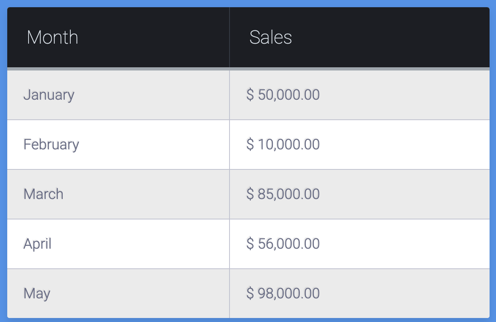

# Web Development Exam

Welcome to your web development exam. Below you will find the questions and tasks you need to complete. Good luck!

---

## Question 1: Layout Recreation

**Objective:** Re-create the layout based on the three provided images, focusing on structure and design elements.

### Instructions:

1. **Marketing Layout:** Construct a layout with a main header, a two-column section underneath, followed by a multi-column gallery of items with a footer. Refer to the first image provided.


2. **Webpage Layout:** Create a webpage with a full-width header and a three-column body section. The first column should be half the width of the second, and the third should be as wide as the first. Use the second image as your reference.

3. **Analytics Dashboard:** Build an analytics dashboard layout with a wide main column on the left and a narrow sidebar on the right, followed by a row of smaller boxes. The bottom of the layout should have a wider footer section. Refer to the third image provided.

**Submission:** Provide the complete HTML and CSS code for each layout.

---

## Question 2: Sidebar Fix

**Objective:** Fix the sidebar layout to correctly display alongside the main content.

### Instructions:

- Review the provided HTML and CSS code snippet.
- Modify the CSS to fix the layout so that the `<aside>` content appears to the right of the `<section>` content, without overlapping or causing layout breaks.
- Ensure that the main content and sidebar are correctly displayed across different screen sizes.

**Code Provided:**

```html
<!-- HTML code snippet -->
<main>
  <header>
    <h1>Site</h1>
  </header>
  <section>
    <article>
      <h2>Title</h2>
      <p>Lorem ipsum dolor sit amet, consectetur adipisicing elit. Nemo molestias ex officia eligendi reiciendis fuga magnam? Ullam ut ab doloremque accusamus iusto aliquam facilis sapiente!</p>
    </article>
    <article>
      <h2>Title</h2>
      <p>Lorem ipsum dolor sit amet, consectetur adipisicing elit. Nemo molestias ex officia eligendi reiciendis fuga magnam? Ullam ut ab doloremque accusamus iusto aliquam facilis sapiente!</p>
    </article>
  </section>
  <aside>
    <div class="module">
      <h3>Module</h3>
      <p>Lorem ipsum dolor sit amet, consectetur adipisicing elit. Optio rem ab delectus fugit repellendus perspiciatis dolor consequuntur tenetur voluptatem a vitae odit aspernatur? Voluptas quisquam corporis nostrum aspernatur aliquid harum saepe ab pariatur veniam iste ipsam alias nemo voluptatibus doloribus.</p>
    </div>
  </aside>
</main>
```

```css
body {
  padding: 30px;
}

header {
  background: lightblue;
}
section {
  background: lightgreen;
  width: 75%;
  float: left;
}
article {
  background: white;
  margin: 0 0 1rem 0;
}
aside {
  background: pink;
  width: 25%;
  float: right;
}
header, article, section, .module {
  padding: 1rem;
}
```

## Question 3: Recreate a Styled Table

Using your knowledge of HTML and CSS, replicate the table shown in the provided image. Your table should match the design as closely as possible, which includes the following requirements:

- **Table Headers:**
  - The table contains two headers: "Month" and "Sales."
  - Background color of the headers should match the dark shade shown.
  - Text color should be white, and the font should be bold.

- **Table Rows:**
  - Each row should list a month and corresponding sales figure.
  - Alternate the background color of each row for better readability (zebra striping).

- **Table Borders:**
  - Borders should be visible between rows as shown.
  - The outer border of the table should be thicker than the inner borders.

- 

## Question 4: Shape Recreation

**Objective:** Recreate the three shapes shown in the provided image using HTML and CSS.

### Instructions:

- Use HTML and CSS to replicate the following shapes:
  - A semicircle.
  - An ellipse.
  - A triangle.
- Ensure the shapes match the colors and proportions shown in the image.

### Shapes to Recreate:
- 


**Submission:**
Provide the HTML and CSS code for each shape. Your code should be well-commented, explaining how you achieved each shape.

