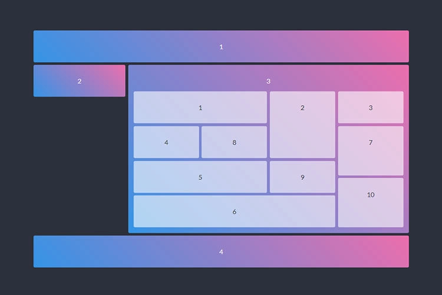

Phần 1 - Trả lời các câu hỏi sau

## HTML

1. HTML là viết tắt của ...?
2. Có phải tất cả các thẻ HTML đều có thẻ đóng?
3. Thẻ Marquee là gì, tác dụng ra sao?
4. Sự khác biệt HTML4 và HTML5
5. Khai báo <!DOCTYPE> trong HTML có tác dụng gì?
6. Tại sao nên đặt `<link>` trong thẻ `<head></head>` và đặt `<script>` trước thẻ `</body>`. Ngoại lệ khi nào?
7. HTML Sematic là gì?
8. Kể tên các thẻ Semantic bạn biết
9. Trình bày cách làm việc (workflow) của bạn khi bạn tạo một trang web?

## CSS

10. Phân biệt position absolute và relative
11. CSS là viết tắt của ...?
12. Lợi / hại của việc sử dụng External Style Sheets?
13. Có mấy cách để sử dụng CSS trên trang web?
14. Phân biệt display: block và display: inline
15. Khác nhau giữa Class selector và Id selector?
16. Hãy kể các breakpoints thông dụng. Viết 1 đoạn code thể hiện “Mobile first” và “PC first”
17. Mặc định thuộc tính display trong thẻ div, span, ul là gì?
18. z-index dùng để làm gì?
19. Cách nào để khôi phục thuộc tính mặc định của một đối tượng?

## JS

20. JavaScript các kiểu biến dạng nào?

    - a. Number, String, Boolean
    - b. Number, Interger, char
    - c. Number, String, Boolean, Null
    - d. Tất cả các loại trên

21. Cách khai báo mảng nào trong JavaScript là đúng?

    - a. var colors = ["red", "green", "blue"]
    - b. var colors = "red", "green", "blue"
    - c. var colors = 1 = ("red"), 2 = ("green"), 3 = ("blue")
    - d. var colors = (1, 2, 3)

22. Ngôn ngữ JS có phân biệt chữ hoa và chữ thường:

    - a. Có
    - b. Không

23. JavaScript là ngôn ngữ xử lý ở:

    - a. Client
    - b. Server
    - c. Server/client
    - d. Không có dạng nào.

24. Javascript là ngôn ngữ thông dịch hay biên dịch

    - a. Thông dịch
    - b. Diễn dịch
    - c. Cả hai dạng
    - d. Không có dạng nào ở trên

25. Trong Javascript hàm parseInt() dùng để làm gì?

    - a. Chuyển một chuỗi thành số
    - b. Chuyển một chuỗi thành số nguyên
    - c. Chuyển một chuỗi thành số thực
    - d. Chuyển một số nguyên thành một chuỗi

26. `{a:1}=={a:1}`

    - a. True
    - b. False

27.

```js
var obj = {
  _name: "CaMapCanCap",
  getMySecretName: function () {
    return this._name;
  },
};
var stoleCaMapName = obj.getMySecretName;
console.log(stoleCaMapName());
console.log(obj.getMySecretName());
```

- a. undefined undefined
- b. undefined CaMapCanCap
- c. CaMapCanCap CaMapCanCap
- d. CaMapCanCap undefined

28.

```js
for (var i = 0; i < 3; i++) {
  setTimeout(() => console.log(i), 1);
}

for (let i = 0; i < 3; i++) {
  setTimeout(() => console.log(i), 1);
}
```

- a. 0 1 2 and 0 1 2
- b. 0 1 2 and 3 3 3
- c. 3 3 3 and 0 1 2

### B. PHẦN 2: TỰ LUẬN

29. Dựng layout bên dưới (màu sắc có thể thay đổi)
    
30. Tạo button với hiệu ứng bên dưới (Icon, màu sắc tuỳ ý)
    
31. Nhập vào mảng A, trả về mảng B gồm các phần tử chẵn của mảng A.
32. Tạo một website với mỗi section có chiều cao là 100vh. Tạo hiệu ứng scroll xuống từng section, cứ mỗi lần scroll sẽ đi xuống hoặc đi lên 1 section
