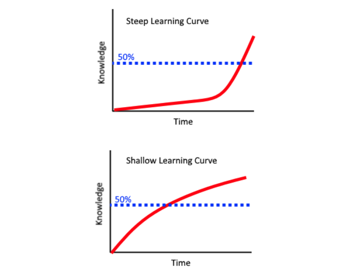

Day 1:

- Greetings
- Installation:
  - Join classroom
  - Join github
  - Install VS Code
    - Extensions:
      - Live server
      - Prettier
      - Format on save
    - Get used to VS Code
- Overview about Software Engineer and Frontend developer
  
  
- Roadmap: https://roadmap.sh/frontend
  - Introduction about Internet and Website, Webpage and Web Application (basically talk about Roadmap Internet session at an beginner)
- How to learn effective:
  - Finish all the exercise
  - Learning curve 

Day 2:

- HTML
